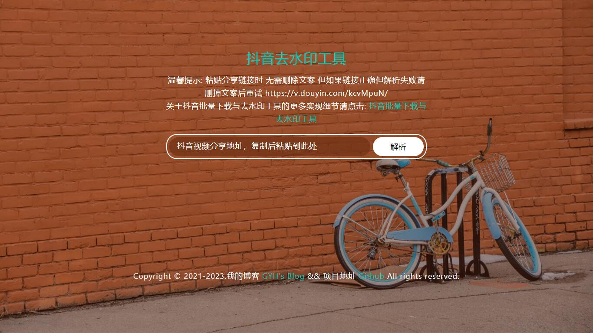
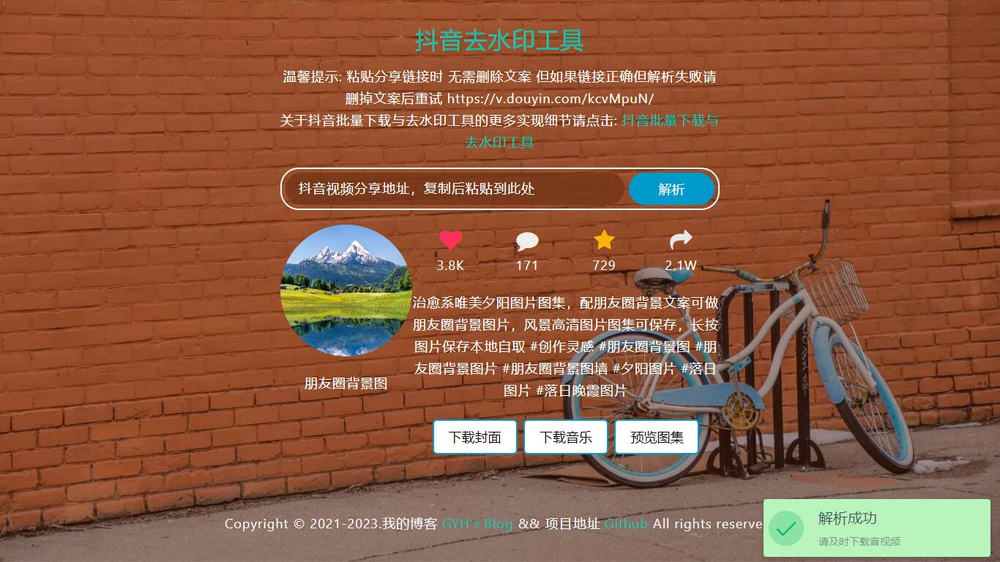

# 前言

本文主要是关于我写的抖音批量下载与去水印工具的介绍。

本项目分为单个作品(视频/图集)去水印工具和批量下载工具

代码已经开源在我的GitHub上，欢迎大家star。

开源地址：https://github.com/imgyh/tiktok

抖音去水印工具Web demo：https://dy.gyh.im/

## 抖音去水印工具 Feature

* 通过作品分享链接获取去水印作品、音乐、封面图、头像
* 获取点赞数、评论数、收藏数、分享数、作品描述等信息
* 基于Flask实现 Web 交互界面







## 抖音批量下载工具 Feature

* 支持个人主页链接、作品分享链接、抖音直播Web链接、合集链接、音乐集合链接
* 支持单个作品下载、主页作品下载、主页喜欢下载、单个合集下载、主页所有合集下载、音乐集合下载
* 下载视频、视频封面、音乐、头像
* 去水印下载
* 自动跳过已下载
* 支持指定下载作品数量


# 使用方法

## 抖音去水印工具

使用抖音去水印工具有三种方式

1. (推荐)直接使用我搭建的抖音去水印工具：https://dy.gyh.im/
2. 使用docker运行

```
docker run -d -p 5000:5000 --name tiktok --restart=always imgyh/tiktokweb
```

3. 本地搭建`python3.9`环境运行

```
cd /path/to/tiktok
python -m pip install -r requirements.txt
python TikTokWeb.py
```

访问: http://localhost:5000

## 抖音批量下载工具

windows用户下载 Releases 中的 [TikTokCommand.exe](https://github.com/imgyh/tiktok/releases) 文件在cmd中运行
windows用户本地有`python3.9`环境, 也可按照linux与mac用户的方式运行

linux与mac用户下载本项目, 在本地`python3.9`环境中运行, 首先需要安装依赖, 安装命令

```
cd /path/to/tiktok
python -m pip install -r requirements.txt
```

运行示例：

- 获取帮助信息

```
windows用户:
.\TikTokCommand.exe -h
linux与mac用户:
python TikTokCommand.py -h
```

- 参数介绍

```
-h, --help                  展示帮助页
--link LINK, -l LINK        1.作品(视频或图集)、合集、音乐集合、个人主页抖音分享链接(删除文案, 保证只有URL, https://v.douyin.com/kcvMpuN/)
                            2.解析直播网页版网址(https://live.douyin.com/802939216127)
--path PATH, -p PATH        下载保存位置
--music MUSIC, -m MUSIC     是否下载视频中的音乐(True/False), 默认为True
--cover COVER, -c COVER     是否下载视频的封面(True/False), 默认为True, 当下载视频时有效
--avatar AVATAR, -a AVATAR  是否下载作者的头像(True/False), 默认为True
--mode MODE, -M MODE        link是个人主页时, 设置下载发布的作品(post)或喜欢的作品(like)或者用户所有合集(mix), 默认为post
--number NUMBER, -n NUMBER  1.当下载单个合集、音乐集合、主页作品(post模式)和喜欢(like模式)时, 可设置下载前n个作品, 默认为0全部下载 
                            2.当下载主页下所有合集(mix模式)时, 设置下载前n个合集下所有作品, 默认为0全部下载
```

- 下载单个作品

```
windows用户:
.\TikTokCommand.exe -l https://v.douyin.com/kcvMpuN/ -p C:\project\test
linux与mac用户:
python TikTokCommand.py -l https://v.douyin.com/kcvMpuN/ -p /path/to/downdir
```

- 下载主页全部作品

```
windows用户:
.\TikTokCommand.exe -l https://v.douyin.com/kcvSCe9/ -p C:\project\test
linux与mac用户:
python TikTokCommand.py -l https://v.douyin.com/kcvSCe9/ -p /path/to/downdir
```

- 下载主页前n个作品

```
windows用户:
.\TikTokCommand.exe -l https://v.douyin.com/kcvSCe9/ -p C:\project\test -n 30
linux与mac用户:
python TikTokCommand.py -l https://v.douyin.com/kcvSCe9/ -p /path/to/downdir -n 30
```

- 下载主页全部喜欢

```
windows用户:
.\TikTokCommand.exe -l https://v.douyin.com/kcvSCe9/ -p C:\project\test -M like
linux与mac用户:
python TikTokCommand.py -l https://v.douyin.com/kcvSCe9/ -p /path/to/downdir -M like
```

- 下载主页前n个喜欢

```
windows用户:
.\TikTokCommand.exe -l https://v.douyin.com/kcvSCe9/ -p C:\project\test -M like -n 30
linux与mac用户:
python TikTokCommand.py -l https://v.douyin.com/kcvSCe9/ -p /path/to/downdir -M like -n 30
```

- 下载单个合集全部作品

```
windows用户:
.\TikTokCommand.exe -l https://v.douyin.com/B3J63Le/ -p C:\project\test
linux与mac用户:
python TikTokCommand.py -l https://v.douyin.com/B3J63Le/ -p /path/to/downdir
```

- 下载单个合集前n个作品

```
windows用户:
.\TikTokCommand.exe -l https://v.douyin.com/B3J63Le/ -p C:\project\test -n 30
linux与mac用户:
python TikTokCommand.py -l https://v.douyin.com/B3J63Le/ -p /path/to/downdir -n 30
```

- 下载主页全部合集下所有作品

```
windows用户:
.\TikTokCommand.exe -l https://v.douyin.com/B38oovu/ -p C:\project\test -M mix
linux与mac用户:
python TikTokCommand.py -l https://v.douyin.com/B38oovu/ -p /path/to/downdir -M mix
```

- 下载主页前n个合集下所有作品

```
windows用户:
.\TikTokCommand.exe -l https://v.douyin.com/B38oovu/ -p C:\project\test -M mix -n 2
linux与mac用户:
python TikTokCommand.py -l https://v.douyin.com/B38oovu/ -p /path/to/downdir -M mix -n 2
```

- 下载音乐集合下所有作品

```
windows用户:
.\TikTokCommand.exe -l https://v.douyin.com/S6YMNXs/ -p C:\project\test
linux与mac用户:
python TikTokCommand.py -l https://v.douyin.com/S6YMNXs/ -p /path/to/downdir
```

- 下载音乐集合下前n个作品

```
windows用户:
.\TikTokCommand.exe -l https://v.douyin.com/S6YMNXs/ -p C:\project\test -n 30
linux与mac用户:
python TikTokCommand.py -l https://v.douyin.com/S6YMNXs/ -p /path/to/downdir -n 30
```

- 关闭头像下载, cover, music 也是一样的设置对应选项为 False

```
windows用户:
.\TikTokCommand.exe -l https://v.douyin.com/kcvSCe9/ -p C:\project\test -a False
linux与mac用户:
python TikTokCommand.py -l https://v.douyin.com/kcvSCe9/ -p /path/to/downdir -a False
```

- 直播推流地址解析

```
windows用户:
.\TikTokCommand.exe -l https://live.douyin.com/802939216127 -p /path/to/downdir
linux与mac用户:
python TikTokCommand.py -l https://live.douyin.com/802939216127 -p /path/to/downdir
```

# ToDo

- [x] 单个合集下载
- [x] 主页所有合集下载
- [x] 获取分享的音乐链接下的所有作品
- [x] 指定下载作品数量
- [ ] 获取热搜榜数据
- [ ] 多主页链接批量下载
- [ ] 多线程下载
- [ ] 保存数据至数据库
- [ ] 制作成接口

# 鸣谢

本项目部分思路来自[TikTokDownload](https://github.com/Johnserf-Seed/TikTokDownload)

# 申明

本项目只作为学习用途, 切勿他用

# License

[MIT](https://opensource.org/licenses/MIT) © [imgyh](https://www.imgyh.com/)

# Star History

[](https://star-history.com/#imgyh/tiktok&Date)
